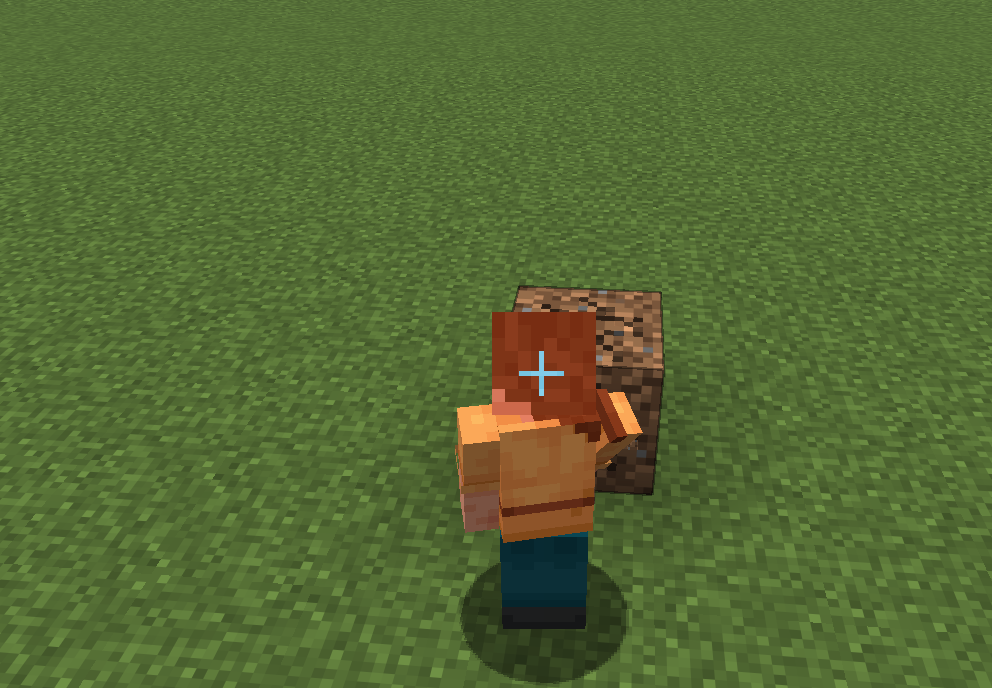

# Crosshair Enabler

This is a Minecraft mod for Fabric that always displays the crosshair, even when in third-person view. The only exception is when viewing the player from the front, where the crosshair would not make sense. This makes it possible to actually play in third-person mode and e.g. place or break blocks, and not just get a temporary overview.

This is a very minimalistic mod. No settings are required nor provided.

## Screenshot

This is what it looks like when you are using the mod.

## Download

You can download the mod from any of these sites:

* [GitHub releases](https://github.com/magicus/crosshair-enabler/releases)
* [Modrinth versions](https://modrinth.com/mod/crosshair-enabler/versions)
* [CurseForge](https://www.curseforge.com/minecraft/mc-mods/crosshair-enabler/files)

## Installation

Install this as you would any other Fabric mod. (I recommend using [Prism Launcher](https://prismlauncher.org/) as Minecraft launcher for modded Minecraft.)

## Support

Do you have any problems with the mod? Please open an issue here on Github.

## Acknowledgements

This mod is inspired by [Third Person Crosshair](https://github.com/ewewukek/fabric-tpcrosshair), which unfortunately is no longer updated.
